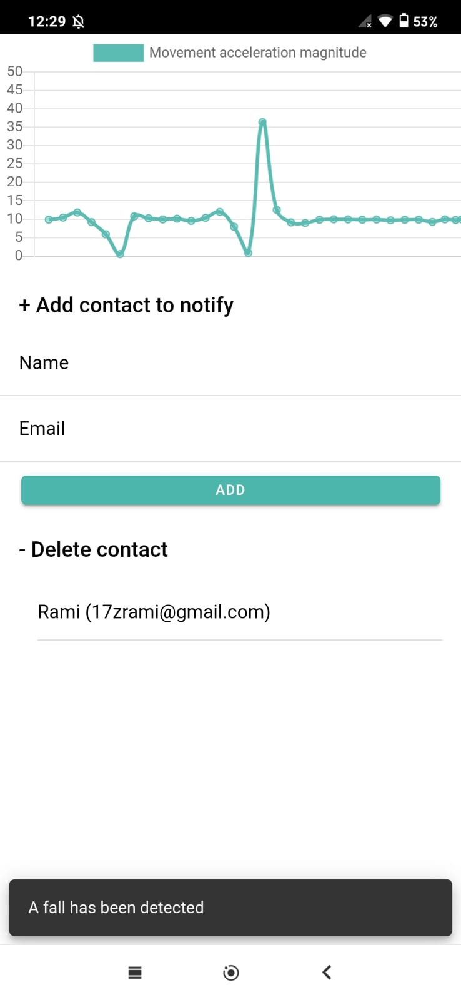
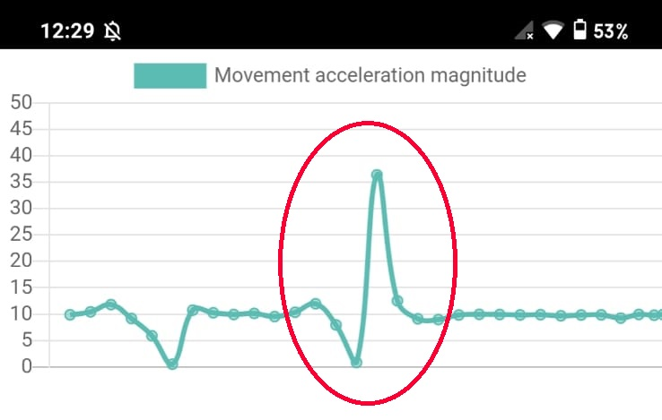

# Appilepsie
une application pour détecter une chute d'une personne pour demander automatiquement de l'aide.
## Tester l'application 

Pour tester l'application, veuillez installer l'application sur un Android.
- Vous devez avoir une connexion Internet.
- Ajoutez des emails pour notifier en cas de chute.
- Faites tomber le téléphone.
- Regardez les boîtes des emails que vous avez ajoutés (Le message peut dans le boites spam).

## Explication
L'algorithme de détection est basé sur les accélérémètres du téléphone.
Lorsqu'un objet tombe, son accélération augmente rapidement. Et comme il s'agit d'une chute libre, l'accélération commence à tomber à zéro.

L'algorithme observe en permanence le changement d'accélération et signale une chute s'il y a un changement qui dépasse un certain seuil.

## Build l'application
L'application est développée en utilisant `ionic`. Pour faire une compilation, veuillez suivre cette documentation.

[ionic cordova build](https://ionicframework.com/docs/cli/commands/cordova-build)